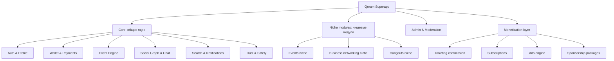
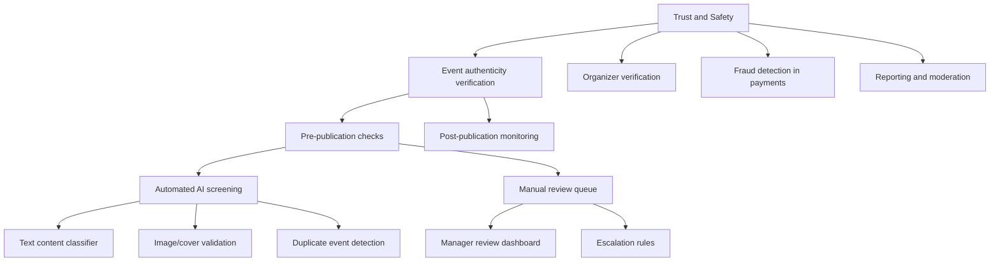
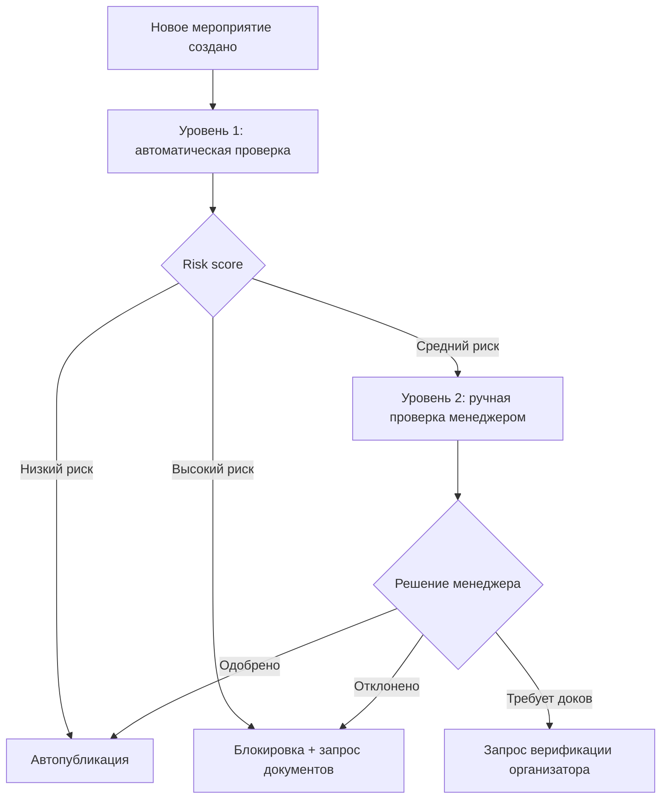
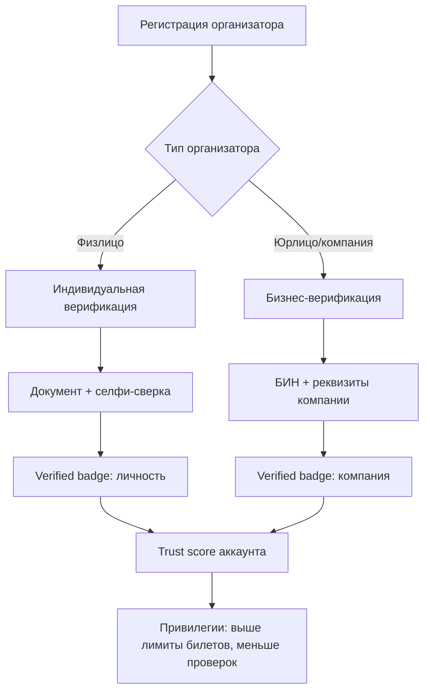
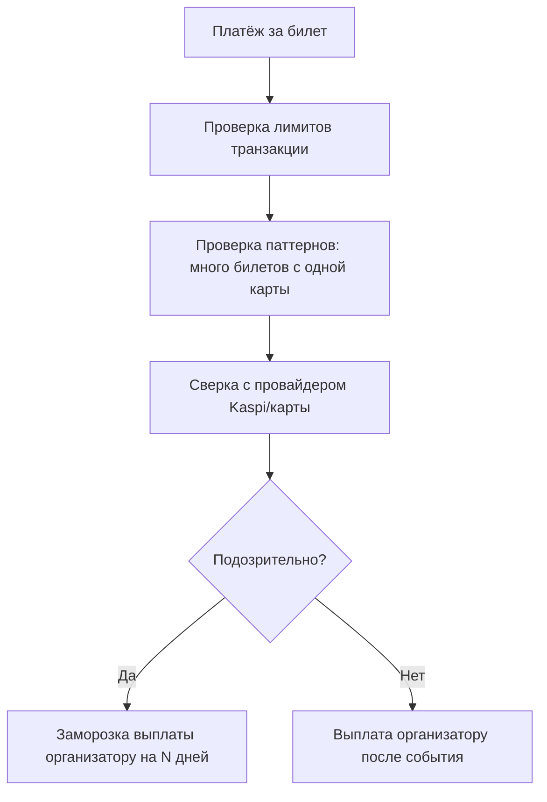
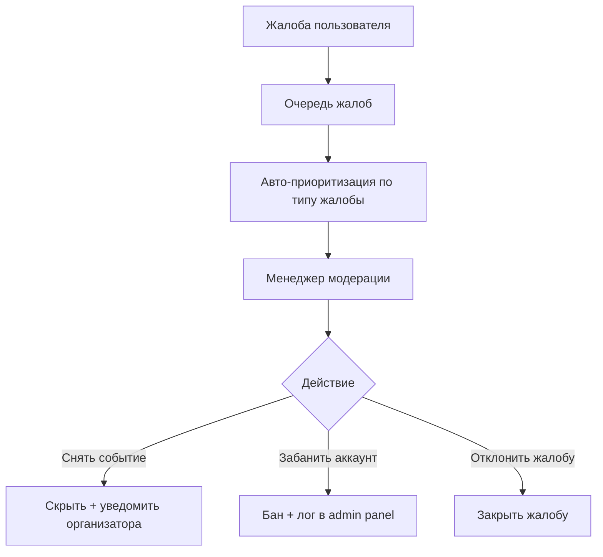
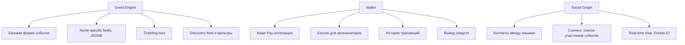

# Eventum— PLAN.md

Документ описывает переработку Eventum Mobile в суперапп-экосистему Qoram: единое приложение с нишами событий (мероприятия, бизнес-нетворкинг, тусовки и др.), общим ядром и раздельной монетизацией. Документ состоит из трёх частей:

1. Концепция и архитектура
2. Дерево декомпозиции системы (вглубь, до уровня конкретных решений)
3. Два roadmap'а — для разработки (техническая реализация) и для проекта (бизнес/продукт/запуск)

---

## 1. Концепция

### 1.1 Идея в одном абзаце

Qoram — это одно мобильное приложение, на главном экране которого пользователь выбирает "нишу" (категорию событий: мероприятия, бизнес и нетворкинг, тусовки, образование, спорт и т.д.). Каждая ниша имеет свой акцентный цвет и иконографию, но использует общий технический core: профиль, кошелёк, конструктор событий, чаты, поиск, модерацию. Это позволяет запускать новые категории как лёгкие модули над существующей инфраструктурой, а не как отдельные продукты.

### 1.2 Ниши на старте

| Ниша                | Цвет      | Роль                  | Монетизация                                |
| ------------------- | --------- | --------------------- | ------------------------------------------ |
| Мероприятия         | coral     | масс-маркет трафик    | комиссия с билетов 3-8%                    |
| Бизнес и нетворкинг | blue      | флагман, высокий ARPU | подписки организаторам, спонсорские пакеты |
| Тусовки             | gray/teal | виральность, охват    | без комиссии, монетизация через рекламу    |

Остальные ниши (образование, спорт, семья, хобби, еда, путешествия) — выход после стабилизации флагмана.

### 1.3 Общее ядро (Core)

Компоненты, общие для всех ниш:

- Аккаунт/профиль (с расширяемыми полями под нишу)
- Кошелёк и платежи (единый баланс, история, выводы)
- Конструктор событий (базовая форма + нишевые поля)
- Социальный граф / чаты (Socket.IO)
- Лента уведомлений и поиск с фильтром по нише
- Модерация и верификация (KYC, рейтинг доверия)
- Рекламный движок (баннеры на главном экране, буст в выдаче)

### 1.4 Маппинг на текущий стек

Текущий стек (React Native/Expo, Flask, SQLAlchemy, SQLite, JWT, Socket.IO) подходит как основа MVP, но требует структурных изменений:

- **SQLite → PostgreSQL.** При мультинишевой модели и росте нагрузки SQLite не подходит для конкурентного доступа и сложных запросов (фильтрация событий по нишам, JSON-поля атрибутов). Миграция обратно на PostgreSQL обязательна до публичного запуска.
- **Модели данных.** Таблица `events` получает поле `niche` (enum) + `attributes` (JSONB) для нишевых полей вместо жёстко заданных колонок.
- **Frontend-навигация.** Текущая Bottom Tabs структура заменяется на: главный экран-хаб с плитками ниш → переход в "под-приложение" ниши с собственным Stack Navigator и применённой цветовой темой через themeStore (Zustand).
- **Платежи.** Текущий Finance Module расширяется интеграцией с Kaspi Pay / локальными платёжными провайдерами Казахстана.

---

## 2. Дерево декомпозиции системы

Ниже — иерархическая разбивка от общих блоков до конкретных технических решений. Структура: блок → подблок → конкретная фича/решение → как реализуется.

### 2.1 Общая карта системы

### 2.2 Глубокая декомпозиция: Trust & Safety (запрошенный пример)

Это блок, который ты упомянул конкретно — "чтобы люди не обманывали, чтобы регистрировались только реальные мероприятия". Разбираем его максимально вглубь.

#### 2.2.1 Event authenticity verification — детально

**Проблема:** организатор может создать фейковое мероприятие (несуществующее место, ложная дата, мошенническая продажа билетов) или мероприятие, не соответствующее заявленной нише/категории.

**Решение разбивается на два слоя: автоматический (AI) и человеческий (менеджер).**

**Как считается risk score (автоматический уровень, AI/правила):**

- Текстовый классификатор проверяет описание на признаки мошенничества (обещания нереалистичных условий, паттерны спама, ранее забаненные формулировки) — реализуется через простой ML-классификатор (или эвристики/regex на старте, без сложного AI) на backend, вызывается при создании события
- Проверка геолокации — совпадает ли указанный адрес с реальной локацией (через геокодинг API), флаг если адрес не существует
- Проверка дублей — хэш по (название + дата + место), если совпадает с уже существующим событием — флаг на дубликат
- История организатора — если у аккаунта 0 прошлых событий и сразу выставлена крупная цена на билет — повышенный risk score
- Все флаги суммируются в числовой score (0-100), пороги настраиваются: 0-30 автопубликация, 31-70 в очередь менеджеру, 71+ блокировка

**Ручная проверка менеджером (Tier 2):**

- Менеджер видит в админ-панели очередь событий со средним риском, с подсвеченными причинами (почему попало в очередь)
- Минимальный SLA — событие должно быть проверено за N часов (например, 24ч), иначе автоэскалация старшему модератору
- Менеджер может: одобрить, отклонить с указанием причины (организатор видит причину и может исправить), запросить доп. верификацию

**Почему именно так (AI vs менеджер):**

- 100% ИИ — дешевле, но даёт false positives/negatives, особенно на старте, когда модель не обучена на локальных данных Казахстана (названия мест, языки RU/KZ)
- 100% менеджер — не масштабируется при росте объёма событий
- Гибрид — AI отсекает явный мусор и явно безопасные события (большинство), менеджер занимается только "серой зоной" — это реалистично для команды из 1-2 модераторов на старте

#### 2.2.2 Organizer verification — детально

- **Физлица:** загрузка документа (ID/паспорт) + проверка через сервис распознавания (на старте можно использовать готовый KYC-провайдер с поддержкой Казахстана, не разрабатывать с нуля)
- **Юрлица:** проверка БИН через открытый реестр (электронное правительство РК предоставляет открытые API проверки юрлиц)
- **Trust score** растёт со временем: успешно проведённые события без жалоб → score растёт → меньше будущих проверок (доверенные организаторы переводятся в Tier 1 автопубликации даже при пограничном risk score)

#### 2.2.3 Fraud detection in payments

- Выплаты организаторам происходят не сразу, а после факта проведения события (escrow-модель) — это главный механизм защиты от "собрал деньги и пропал"
- Для новых организаторов — задержка выплаты выше (например, 100% после события + 3 дня), для verified с высоким trust score — частичная предоплата возможна

#### 2.2.4 Reporting and moderation

- Типы жалоб приоритизируются: "мошенничество с оплатой" > "не соответствует описанию" > "спам" — критичные жалобы получают SLA в 2 часа
- Текущий Admin Dashboard (уже есть в проекте — "View and manage all users, ban/unban") расширяется этой очередью жалоб как новый раздел

### 2.3 Декомпозиция остальных крупных блоков (компактно)

---

## 3. Roadmap для разработки (техническая реализация)

Цель — переписать Eventum Mobile в Qoram MVP с тремя нишами и базовым Trust & Safety.

### Фаза 0: Фундамент (инфраструктура)

- Миграция базы данных SQLite → PostgreSQL, обновление SQLAlchemy моделей
- Рефакторинг модели `Event`: добавить поле `niche` (enum: events, business, hangouts) и `attributes` (JSONB)
- Рефакторинг модели `User`: добавить `trust_score`, `verification_status`, `organizer_type`
- Настройка staging-окружения (отдельная БД, отдельный backend instance)

### Фаза 1: Главный экран и навигация по нишам

- Новый главный экран-хаб: грид плиток ниш + рекламный баннер-слот
- Динамическая тема через Zustand (themeStore): при входе в нишу применяется акцентный цвет и иконография
- Навигационная структура: Hub → Niche Stack (каждая ниша — свой Stack Navigator с возвратом на Hub)
- Рекламный баннер на хабе: модель `Ad`, простой backend endpoint для ротации баннеров (без сложного ad-engine на старте — ручное размещение через админку)

### Фаза 2: Конструктор событий с нишевыми полями

- Базовая форма (общая для всех ниш): название, описание, дата, локация, обложка, цена/донат/бесплатно
- Динамические поля по нише (рендерятся на основе `niche` — конфиг хранится на frontend, отправляется как JSON в `attributes`)
- Для "Бизнес и нетворкинг": поля спикеры, спонсоры, программа
- Для "Тусовки": минимальная форма, без билетов (только донат/бесплатно)

### Фаза 3: Trust & Safety — Tier 1 (автоматика)

- Backend: модуль risk scoring при создании события
  - Эвристика дублей (хэш название+дата+место)
  - Геокодинг адреса через внешний API, флаг при невалидном адресе
  - Проверка истории организатора (новый аккаунт + высокая цена = флаг)
- Хранение `risk_score` и `risk_flags` в модели Event
- Пороговая логика: score → статус (`auto_published`, `pending_review`, `blocked`)

### Фаза 4: Trust & Safety — Tier 2 (менеджер) + Admin расширение

- Новый раздел в существующем Admin Dashboard: очередь событий на ревью (`pending_review`)
- UI карточки события с подсветкой причин попадания в очередь (`risk_flags`)
- Действия менеджера: одобрить / отклонить с причиной / запросить доки
- SLA-таймер и автоэскалация (cron job, проверка событий старше N часов в очереди)
- Раздел жалоб (Reports queue) с приоритизацией по типу

### Фаза 5: Верификация организаторов

- Регистрация организатора: выбор типа (физлицо / юрлицо)
- Интеграция с готовым KYC-провайдером для физлиц (документ + селфи)
- Интеграция с реестром БИН (электронное правительство РК) для юрлиц
- Verified badge на профиле, влияние на risk score (verified → ниже пороги ручной проверки)

### Фаза 6: Платежи и escrow

- Интеграция Kaspi Pay (или доступный местный платёжный провайдер) в Finance Module
- Escrow-логика: средства от продажи билетов холдятся на платформе до даты события + N дней
- Автоматическая выплата организатору после события (cron job)
- Fraud-проверка на платежах: лимиты, паттерны множественных покупок с одной карты

### Фаза 7: Social Graph между нишами

- Расширение модели контактов: контакт не привязан к нише, виден везде
- Модуль "Connect" для бизнес-ниши: список зарегистрированных участников события, запрос контакта
- Расширение чатов (текущий Socket.IO) — без структурных изменений, только UI-доступ из разных ниш

### Фаза 8: QA, нагрузочное тестирование, релиз MVP

- E2E-тестирование сценариев: создание события каждой ниши, прохождение risk scoring, модерация, оплата с escrow
- Нагрузочное тестирование PostgreSQL + Socket.IO под конкурентным доступом
- Закрытая бета с 2-3 партнёрами-организаторами (см. roadmap проекта)

---

## 4. Roadmap для реализации проекта (бизнес/продукт)

Цель — превратить MVP в работающий бизнес на рынке Казахстана.

### Этап 1: Подготовка и партнёрства

- Зафиксировать флагманскую нишу — "Бизнес и нетворкинг" (наименее конкурентная, выше ARPU)
- Договориться с 3-5 организаторами-партнёрами для первого контента (хабы, бизнес-ассоциации, конференц-операторы)
- Вручную загрузить календарь известных деловых мероприятий на 3-6 месяцев вперёд для ощущения "наполненности" с первого дня

### Этап 2: Закрытая бета

- Запуск с тремя нишами (Мероприятия, Бизнес и нетворкинг, Тусовки) для ограниченной группы пользователей (партнёры + их аудитория)
- Сбор обратной связи по UX переключения между нишами и по работе risk scoring (нет ли излишних блокировок легитимных событий)
- Калибровка порогов risk score на реальных данных

### Этап 3: Публичный запуск в Алматы

- Региональный запуск (один город) для управляемого масштаба нагрузки на модерацию
- Команда: 1-2 модератора для Tier 2 проверки на старте
- Маркетинг: таргет на организаторов через партнёрские сети (хабы, ассоциации) + таргет на пользователей через рекламу самой платформы

### Этап 4: Монетизация активация

- Включение комиссии с билетов в нише "Мероприятия"
- Запуск подписок и спонсорских пакетов в "Бизнес и нетворкинг" — первые сделки со спонсорами через личные продажи (не самообслуживание)
- Рекламный движок на главном хабе — первые рекламодатели через личные продажи

### Этап 5: Расширение географии и ниш

- Масштабирование на Астану, Шымкент
- Запуск следующей ниши (рекомендация: "Образование" — высокая платёжеспособность, низкая конкуренция) как маркетинговый повод для реактивации базы
- Постоянная калибровка Trust & Safety по мере роста объёма (пересмотр порогов, добор модераторов)

### Этап 6: Региональная экспансия

- Адаптация под платёжные системы Узбекистана/Кыргызстана
- Локализация (язык, специфика верификации юрлиц для других стран)
- Повторение модели "флагманская ниша + лёгкие модули" в новых регионах
